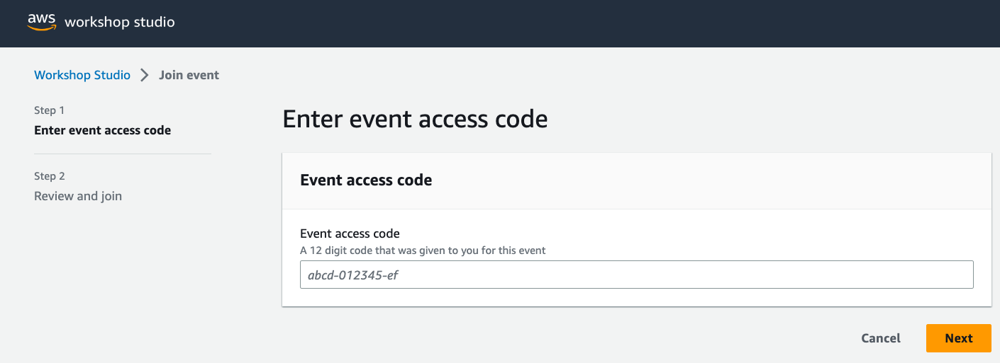
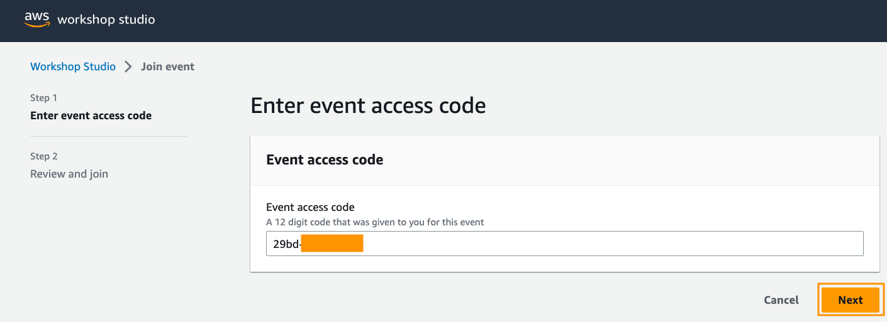
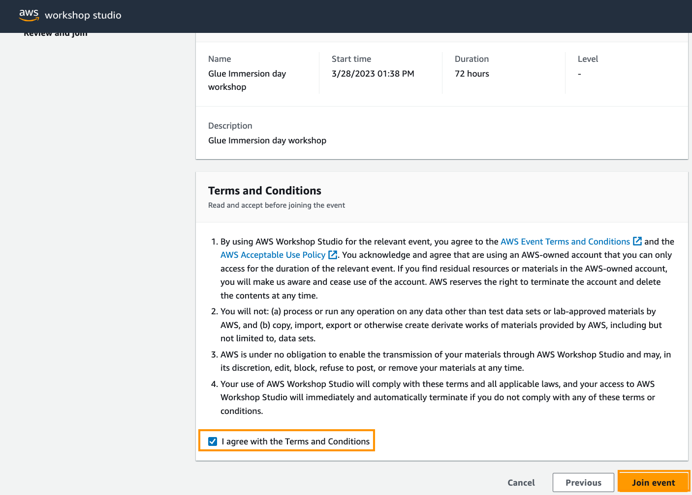
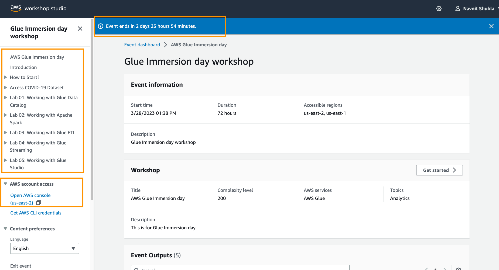
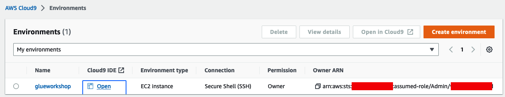
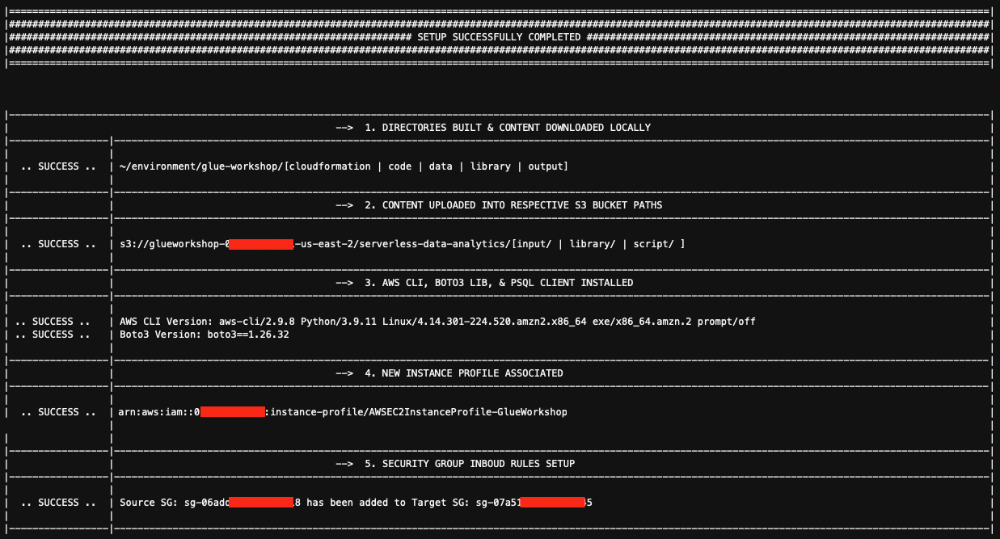
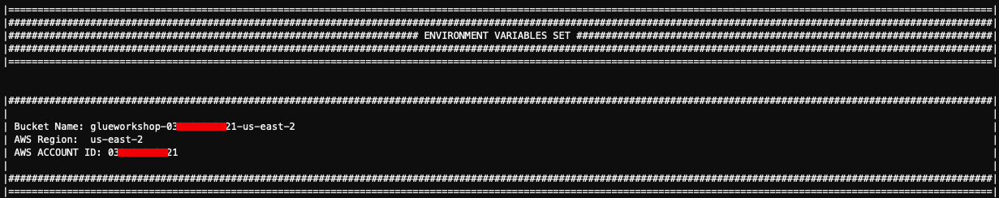
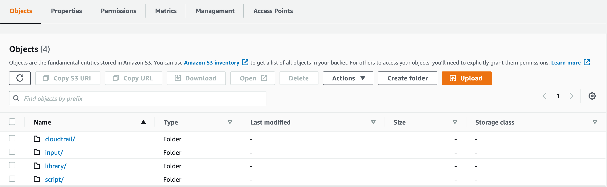

# 00 - Setup e Configuração de ambiente


### Conta AWS

1. Acesse o [Workshop Studio](https://catalog.us-east-1.prod.workshops.aws/join?)
2. Utilize o `Email one-time password (OTP)` para acessar a plataforma.
   
   

3. Digite o **código de acesso** fornecido pelo seu professor e clique em **Avançar**.
   
   

4. Role para baixo, revise os termos e condições e marque a caixa de Termos e Condições e clique em **Join event**
   
   

5. Isso o levará ao painel com acesso à conta do bootcamp AWS.

    

6. Clique em **Open AWS console** e ele o levará ao AWS Console (conta do bootcamp).


### Prepare variáveis do Cloud9, diretórios locais, arquivos e configurações do Bootcamp

1. Vá para o console da [AWS Cloud9](https://console.aws.amazon.com/cloud9/) em seu ambiente e você verá uma Cloud9 com o nome `Glueworkshop`.Clique em **Open IDE** para entrar no ambiente Cloud9 IDE.

    

2. Copie comandos abaixo (sempre use o pequeno ícone de cópia no canto superior direito do bloco de código !!!) e cole-o no seu **terminal da linha de comando Cloud9**:


```shell
cd ~/environment/

echo "==================> DOWNLOADING & EXECUTING THE ONE-STEP-SETUP SCRIPT <====================
$(curl -s 'https://static.us-east-1.prod.workshops.aws/public/690aeb62-f64c-4570-9d6e-c97a3d3f4adb/static/download/howtostart/awseevnt/s3-and-local-file/one-step-setup.sh' --output ~/environment/glue-workshop/library/one-step-setup.sh --create-dirs)
==========================================================================================="

. ./glue-workshop/library/one-step-setup.sh  'https://static.us-east-1.prod.workshops.aws/public/690aeb62-f64c-4570-9d6e-c97a3d3f4adb/static/0/'

```
> **NOTA**: Os comandos acima baixarão e executarão automaticamente um script chamado one-step-setup.sh.O nome do script fala por si, por executá-lo, todos os pré-etapas necessários serão configurados automaticamente para este bootcamp.





3. Agora que você terminou as etapas iniciais da preparação, vá para o [console do Amazon S3](https://s3.console.aws.amazon.com/s3/) e explore o bucket criado na inicialização.Você deve ver os seguintes prefixos no balde.Reserve algum tempo para explorar o conteúdo no balde e, em seguida, volte a esta página, pois você ainda tem um último passo para executar!



4. Execute o comando `npm install -g c9` para instalar a ferramenta que irá ajudar a criar e editar documentos no Cloud9

1. Por fim, usaremos um conjunto de dados particionados de uma amostra do clickstream DataSource para trabalhar com a indexação de partição com o Glue catalog no primeiro laboratório. Execute os seguintes comandos no terminal Cloud9 para sincronizar as partições com seu próprio bucket S3.

```shell
/usr/bin/aws s3 sync s3://redshift-immersionday-labs/data/clickstream/uservisits_parquet1/customer=1/ s3://${BUCKET_NAME}/input/syncstreamingdata/customer=1/ --exclude "*" --include "visitYearMonth=1992*"
/usr/bin/aws s3 sync s3://redshift-immersionday-labs/data/clickstream/uservisits_parquet1/customer=2/ s3://${BUCKET_NAME}/input/syncstreamingdata/customer=2/ --exclude "*" --include "visitYearMonth=1992*"
/usr/bin/aws s3 sync s3://redshift-immersionday-labs/data/clickstream/uservisits_parquet1/customer=3/ s3://${BUCKET_NAME}/input/syncstreamingdata/customer=3/ --exclude "*" --include "visitYearMonth=1992*"
```