# 01 - Glue Catalog

### laboratórios neste módulo

- [01 - Glue Catalog](#01---glue-catalog)
    - [laboratórios neste módulo](#laboratórios-neste-módulo)
  - [Criando com CLI](#criando-com-cli)
  - [Usando notificações do S3](#usando-notificações-do-s3)

## Criando com CLI

1. No terminal do Cloud9 execute os comandos abaixo para garantir que tem as variaveis necessárias para o exercicio disponiveis no terminal.

```shell
AWS_ACCOUNT_ID=`aws sts get-caller-identity --query Account --output text`
AWS_REGION=`aws configure get region`
BUCKET_NAME=glueworkshop-${AWS_ACCOUNT_ID}-${AWS_REGION}
echo "export BUCKET_NAME=\"${BUCKET_NAME}\"" >> /home/ec2-user/.bashrc
echo "export AWS_REGION=\"${AWS_REGION}\"" >> /home/ec2-user/.bashrc
echo "export AWS_ACCOUNT_ID=\"${AWS_ACCOUNT_ID}\"" >> /home/ec2-user/.bashrc
echo ${BUCKET_NAME}
echo ${AWS_REGION}
echo ${AWS_ACCOUNT_ID}
```

2. Para verificar como é o arquivo de amostra de dados a ser utilizado execute o comando `c9 open ~/environment/glue-workshop/data/lab1/csv/sample.csv`
3. Vamos primeiro criar o banco de dados do Glue catalog a ser utilizado. Para isso execute o comando abaixo no terminal do cloud9:
``` shell
aws glue create-database --database-input "{\"Name\":\"console_glueworkshop\", \"Description\":\"This database is created using AWS CLI\"}"
```

4. Verifique o banco de dados  criado na página de [serviço do Glue](https://us-east-2.console.aws.amazon.com/glue/home?region=us-east-2#/v2/data-catalog/databases).Você verá um banco de dados com nome **console_glueworkshop** na seção de bancos de dados do Glue.

    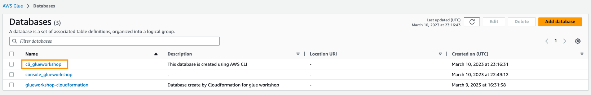

5. Agora vamos criar o crawler que vai varrer os CSV e Json do lab1 no bucket S3 e criar tabela no banco de dados récem criado. Para tal, execute o comando abaixo:
```shell
aws glue create-crawler \
--name cli-lab1 \
--role AWSGlueServiceRole-glueworkshop \
--database-name console_glueworkshop \
--table-prefix console_ \
--targets "{\"S3Targets\": [{\"Path\": \"s3://${BUCKET_NAME}/input/lab1/csv\"}, \
                            {\"Path\": \"s3://${BUCKET_NAME}/input/lab5/json\"} ]}"
```

6. Uma vez criado, é necessário rodar o crawler via CLI. O Crawler vai demorar por volta de 2 minutos para executar. O comando abaixo executa o crawler:

``` shell
aws glue start-crawler --name cli-lab1
```


7. Depois que os crawlers terminarem em execução, você poderá ver os resultados clicando em tabelas à esquerda da página do console Glue. Você deve ver duas novas tabelas criadas pelos rastreadores - ***cli_csv*** e ***cli_json***.
   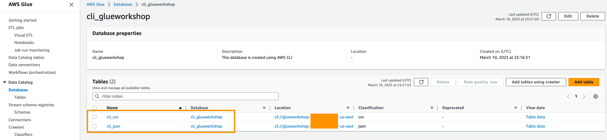

8. Clique na tabela ***cli_csv*** e você verá o esquema da tabela gerado automaticamente pelo crawler com base no arquivo CSV.
   
   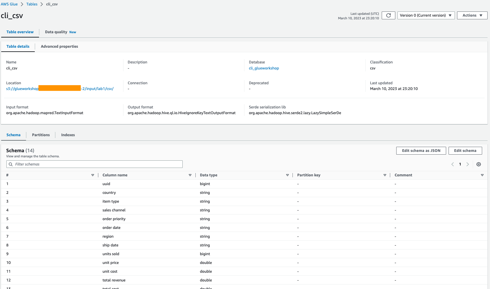

9. Clique na tabela cli_json e você verá o esquema da tabela gerado automaticamente pelo crawler com base no arquivo json.
    
    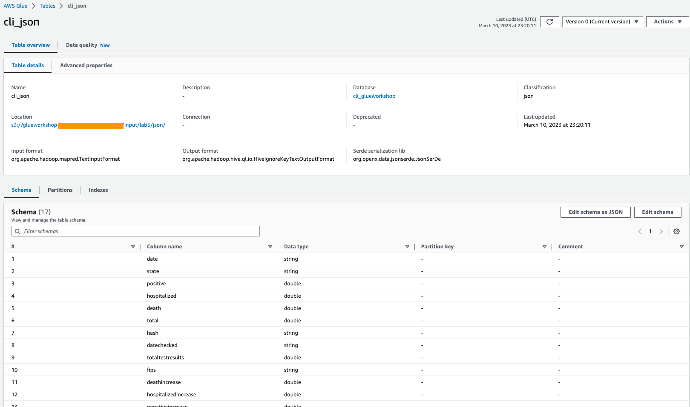


## Usando notificações do S3

Como parte do cloudformation do bootcamp, a notificação de eventos S3 e uma fila SQS que recebem a notificação já foram criadas em seu ambiente de laboratório.

1. Vá para o [console do AWS S3](https://console.aws.amazon.com/s3/), clique em Bucket cujo o nome inicia com **glueworkshop**, clique na guia Propriedades e role para baixo até a seção de notificações de eventos. Você deve ver que as notificações de eventos do Amazon S3 foram configuradas para enviar todos os objetos Criar eventos com um filtro na pasta `input/lab1/eventNotification/` para a fila SQS com nomes Glueworkshop-Lab1-Event-queue.

    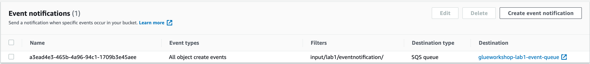

2. Clique no link `Glueworkshop-Lab1-Event-queue` e vá para a página Detalhes da fila do SQS.Copie a fila SQS ARN e salve-a em uma área de transferência.Você precisará disso em uma etapa posterior.

    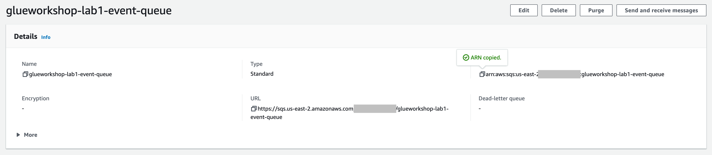

3. Vá para o [AWS Glue console](https://console.aws.amazon.com/glue/), clique em **Crawlers** à esquerda no **catálogo de dados** e clique em **Criar crawler**.
4. Na página **Set Crawler Properties**, defina o nome para o novo crawler como `Event-Notification-Lab1`, clique em **Next**.
5. Na página **Choose data sources and classifiers**, selecione **Not Yet** em **Data source configuration**, clique em **Add a data source**. Na **Add data source** e no caminho S3, navegue para `s3://${BUCKET_NAME}/input/lab1/eventnotification/`.Nas **Subsequent crawler runs**, selecione `Crawl based on event`.
6. Na página **Add a data store**, em **Include SQS ARN** cole o ARN copiado da fila SQS que você salvou anteriormente, e clique em **Add an S3 data source**.

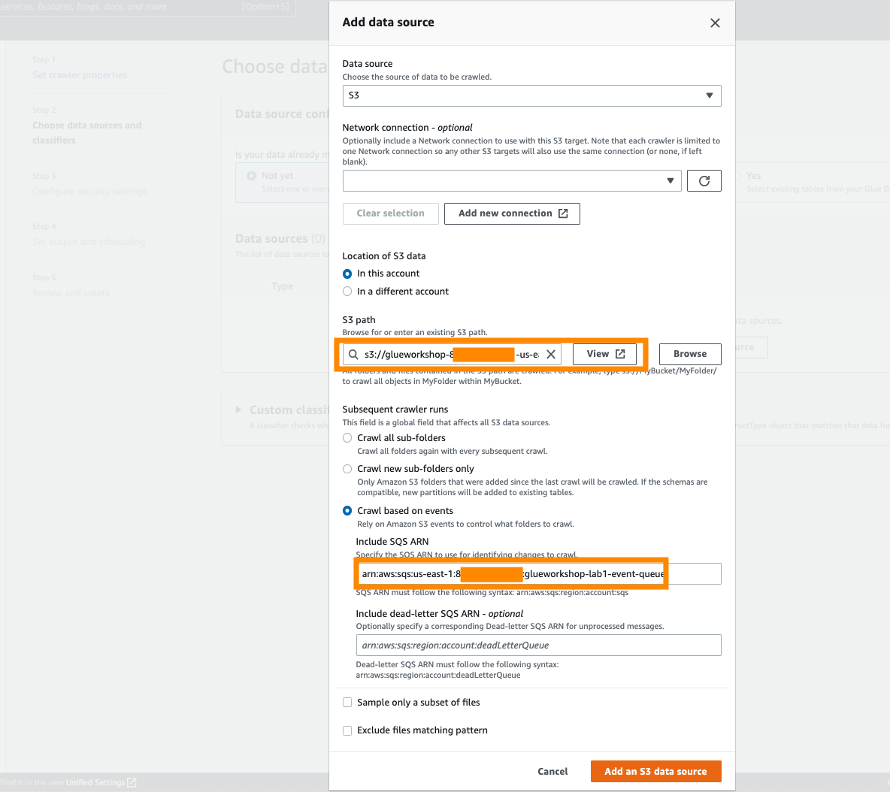

7. na página **Choose data sources and classifiers**, clique em **Next**.
8. Na página **Configure security settings**, na função IAM existente e escolha a função `AWSGlueServiceRole-glueworkshop` e clique em **Next**.
9. Na página **Set output and scheduling**, escolha `console_glueworkshop` na lista do banco de dados de destino e defina o prefixo adicionado às tabelas para `event_notification_` e, no **Crawler schedule**, selecione **On demand** e clique em **Next**.

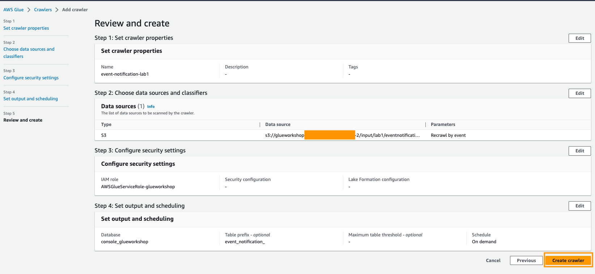

10. Clique em **Create crawler**.
11. Clique na caixa de seleção ao lado do crawler `event-notification-lab1` e clique em **Run crawler** para executar o crawler pela primeira vez. O primeiro rastreamento do crawler usando as notificações de eventos S3 é executado no modo de listagem, executando uma listagem completa do destino do Amazon S3.
12. Depois que o crawler terminar a primeira execução, clique no link de **view log** para `Event-Notification-Lab1`. Você deve ver o log do CloudWatch da primeira execução como o exemplo.

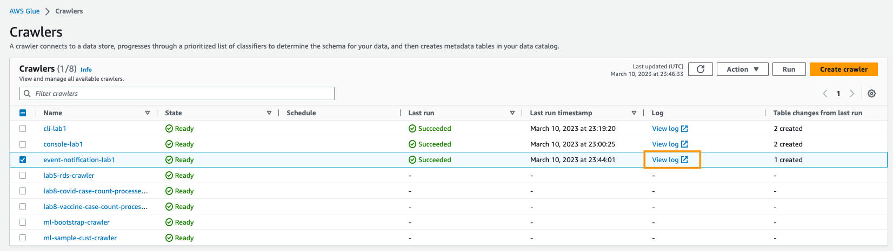

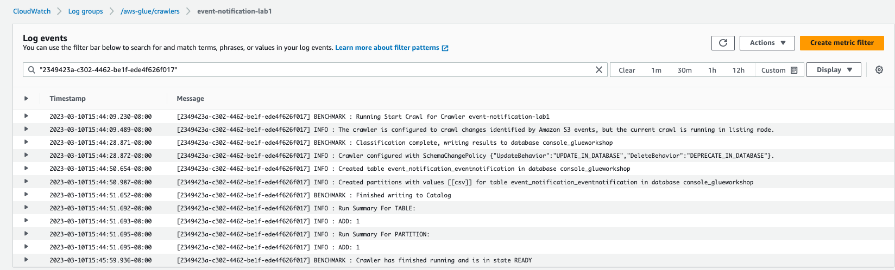

13. Para executar o crawler utilizando a notificação do S3 você vai copiar um novo Json para o S3 utilizando o comando abaixo no Cloud9.

``` shell
aws s3 cp  ~/environment/glue-workshop/data/lab4/json/sample.json s3://${BUCKET_NAME}/input/lab1/eventnotification/json/sample.json
```

14.  De volta ao console do Glue você verá que o crawler começou a executar. A atualização pode levar alguns instântes.
15. Depois que o crawler terminar a execução, clique no link de **view log** para `Event-Notification-Lab1`. Você deve ver o log do CloudWatch.

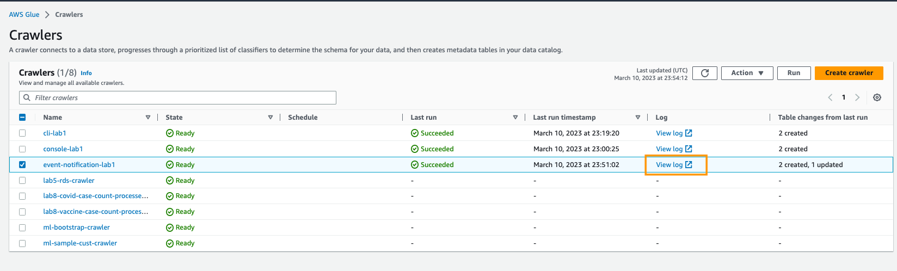

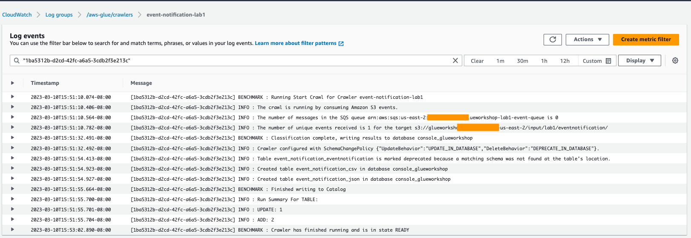
