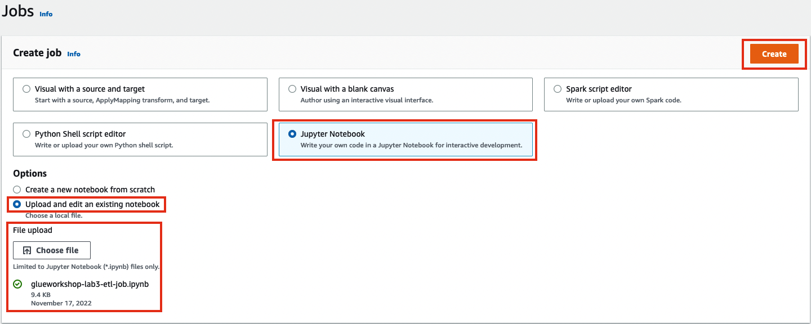

# 01 - Glue Catalog

### Utilizando notebook para criar Glue ETL Job

Para este laboratório, você deve fazer o download dos arquivos do notebook (**glueworkshop-lab3-etl-job.ipynb**) e salvá-lo em um local seguro no computador local:

<a id="raw-url" href="https://static.us-east-1.prod.workshops.aws/public/690aeb62-f64c-4570-9d6e-c97a3d3f4adb/static/download/lab3/etl-job/glueworkshop-lab3-etl-job.ipynb">Baixe o Notebook file</a>

1. Vá para o [AWS Glue Studio Console](https://console.aws.amazon.com/gluestudio/home), clique em **Jobs** no menu do lado esquerdo, em **Create job** Escolha o **Jupyter Notebook** e selecione a opção **Upload and edit an existing notebook**.Clique no botão **Choose file** para fazer upload do arquivo de notebook que você acabou de baixar.

2. Navegada para a pasta do computador local, onde o arquivo **glueworkshop-lab3-etl-job.ipynb** foi baixado e escolha. Em seguida, clique no botão **Create** laranja no lado superior direito.
3. Na próxima tela, nomeie seu trabalho como `glueworkshop-lab3-etl-job`, escolha o role **AWSGlueServiceRole-glueworkshop** na lista de função do IAM e clique no **Start notebook job**.

4. Aguarde a finalização da configuração do notebook. Quando terminar, a tela ficará como o exemplo abaixo:

5. Role um pouco para baixo, mas, antes de executar a primeira célula, certifique -se de substituir os dois espaços reservados ${bucket_name} nesta célula pelo nome do seu bucket S3 .Em seguida, execute a primeira célula para definir algumas propriedades de configuração para este notebook.

6. Agora, para realmente iniciar o notebook com uma sessão de Spark com todas as configurações fornecidas no lugar, execute a **segunda célula**. Aguarde até ver a   mensagem **Session [SOME_SESSION_ID] has been created** como a imagem abaixo.
v

7. Para confirmar que as propriedades acima foram aplicadas adequadamente à definição do trabalho, vá até **Job Details**, rolar para baixo e expandir a seção **Advanced properties** , continue rolando até ver os **Job parameters**. Lá você deve ver as entradas para a interface do usuário do Spark e o caminho do log Spark, bem como entradas para as bibliotecas Python extras e jars.
8. Agora é hora de executar cada bloco de código que você tem lá no seu notebook, então volte para a guia Notebook.

> ***Observação!*** Sempre execute um bloco após o outro! Sempre que você executa um bloco, você deve esperar que ele seja concluído antes de prosseguir para o próximo.Além disso, certifique -se de ler e entender o que cada peça de bloco está fazendo antes de executá -las!

9. Agora, antes de executar a terceira célula, certifique -se de substituir $ {bucket_name} pelo nome do seu Bucket S3. Em seguida, execute a terceira célula abaixo:

> **Observação!** Esta célula não retorna nenhuma saída.Você deve ver um sinal [*] mostrando quando estiver em execução. Uma vez feito, você verá um número dentro [].Isso significa que terminou.

10. Agora, execute a quarta célula que grava a saída em um bucket S3 usando a API do Spark Dataframe. Aguarde finalizar para passar para o próximo passo.

11. Depois que a execução da célula terminar, você pode ir ao [console S3](https://s3.console.aws.amazon.com/s3/) e ir para o seu S3://${bucket_name}/output/lab3/notebook/pasta. Você deve ver alguns arquivos criados. Clique em um desses arquivos e explore -os usando a opção **S3 Select** como mostrando no GIF abaixo:

12. Na próxima etapa, você aprenderá como é fácil Glue Studio Notebooks em um job implantável!
13. Basta salvar o job clicando no botão **Save** no canto superior direito do Glue Studio Console (próximo ao botão laranja Run) e é isso!
14. Depois de salvar o trabalho, clique em Stop Notebook para interromper a sessão do Spark e clique em Trabalhos no menu da extrema esquerda para voltar à sua lista de trabalhos.

### Rodar o Glue ETL Job

1. Se você ainda não está lá, vá para o [AWS Glue Studio console](https://console.aws.amazon.com/gluestudio/home)  Clique em **Jobs** no menu do lado esquerdo e, na **Your jobs**, você poderá ver o trabalho que você criou na seção anterior deste laboratório.

2. Você pode ver o trabalho que você criou anteriormente. Clique na caixa de seleção perto do **glueworkshop-lab3-etl-job** e clique no botão **Run Job**.
3. Você notará um banner verde com uma mensagem de sucesso na parte superior da tela.Neste banner, clique nos detalhes da execução para seguir a execução do seu trabalho.

4. Você também pode clicar no **Monitoring**, no menu esquerdo, para ver o painel com um resumo geral do trabalho. Role para baixo até a parte de baixo do painel e você também deve ver seu trabalho rodando lá. Clique no botão ao lado para o seu trabalho em execução e, a partir daí, clique no botão laranja **View run details**.

