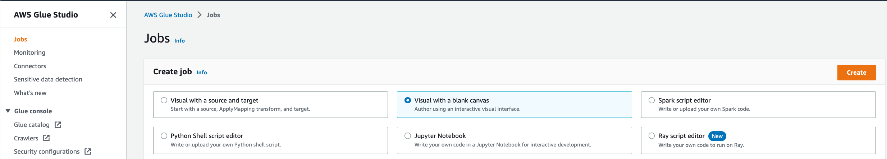

# 01 - Glue Studio

### Transformações Básicas


1. Abra o menu [Glue Studio](https://console.aws.amazon.com/gluestudio/home) à esquerda e clique em **Jobs**.
2. Em **Create job**, selecione **Visual with a blank canvas**, e clique **Create**.


3. Renomeie o job para `glueworkshop-lab5-basic-job`. Agora você tem um editor de trabalho visual em branco do Studio.


4. Clique na guia Script, você deve ver editor vazio para o script do Glue ETL. À medida que adicionamos novas etapas no editor visual, o script será atualizado automaticamente.


5. Clique na aba **Job Details** para ver todas as configurações do job.
    - IAM role: `AWSGlueServiceRole-glueworkshop`
    - Glue version: `Glue 3.0 - Support Spark 3.1, Scala 2, Python 3`
    - Requested number of workers: `4`
    - Job bookmark: `Disable`
    - Number of retries: `0`


6. Se houver um botão no topo da tela `Try new UI`, desabilite ele para voltar ao editor visual a versão dos prints.
7. Clique na aba **Visual** novamente para voltar ao Editor Visual. Você deve ver 3 botões: source, action e target, clique em **action**. Você notará que existem ações prontas e ações personalizadas. O Glue Studio foi projetado para ser usado por desenvolvedores que poderiam escrever código Apache Spark, Glue e SQL personalizado, mas também fornece ações comuns prontas. Nesta parte do laboratório, você entenderá como usar ações básicas no Glue Studio.


8. Clique em **Source** e selecione **AWS Glue Data Catalog**
   - Clique em aba **Data source properties - Data Catalog**
     - Database: `console_glueworkshop`
     - Table: `console_json`
   - Clique na aba **Node properties**
     - Name: `COVID data`
> **Observação**: Este é o conjunto de dados Covid-19 que carregamos em passos anteriores


9. Clique em **Action** e selecione **Drop Fields**. Na guia **Transform**, selecione todos os campos, exceto os seguintes, mostrados na tela, verificando a caixa de seleção ao lado do nome do arquivo para soltar esses campos.Ou, em outras palavras, mantenha (desmarcado) os campos mencionados abaixo.
    - date
    - state
    - deathincrease
    - hospitalizeincrease


10. Clique na guia **Data Preview** e clique em **Start data preview session**, escolha `AWSGlueServiceRole-glueworkshop` e clique em **Confirm**. Aguarde a sessão de visualização de dados ficar pronta e clique no botão **Preview 4 de 9 fields**.Você poderá visualizar a saída do nó de ação atual. Em qualquer etapa de ação, você pode visualizar o resultado da etapa indo para a guia **Data Preview**.


11. Clique em **Action** e selecione **Filter**. Na guia **Transform**, selecione `Global AND` clicando no radio button e adicione **Filter conditions** com:
   - **Key**: `state` **Operation**: `matches` **Value**: `NY|CA` e clique em `Save`


12. Clique no **Action** e selecione **Change Schema**. Na guia **Tansform**:
   - Mude o tipo do campo `deathincrease`  para `int`
   - Mude o tipo do campo `hospitalizedincrease`  para `int`


13. Clique em **Source** e selecione **S3**:
    - Clique na guia **Data source properties - S3**
      - S3 source type: `S3 location`
      - S3 URL: s3://${BUCKET_NAME}/input/lab5/state/
      - Clique no botão **Infer schema** no final.
    - Clique na  gui **Node properties**
      - Name: `State Name`
      - Clique em **Save**

 

14. Clique na caixa de ação **Change Schema** na tela para destacá -la, clique em **Action** e selecione **Join**.
    - Clique na aba **Node properties**
      - Em **node parents**, selecione `State Name` Clicando na caixa de seleção ao lado
    - Clique na aba **Transform**
      - Join type: `Left Join`
      - Em **Join condition** clique em **Add condition**, em **Change Schema** selecione `state`, em **State Name** e selecione `Code`


15. Clique em  **Action** e selecione **Aggregate**. Na aba **Transform**:
    - Fields to group by: `StateName`
    - Clique em **Aggregate another column**
      - Coloque **Field to aggregate**:`deathincrease`, **Aggregation function**: `sum`
      - Coloque **Field to aggregate**:`hospitalizeincrease`, **Aggregation function**: `sum`


16.  Clique em **Target** e selecione **S3**:
    - Na guia **Data target properties - S3**
      - Format: `JSON``
      - Compression Type: `None`
      - S3 Target Location: `s3://${BUCKET_NAME}/output/lab5/basic/`


17. Clique `Save` e então clique em `Run`.
18. Clique na guia **Runs** a tela de design para monitorar o status de execução do job. Aguarde o **Run statuso** atualizar para `Succeeded`.


19. Você pode baixar os arquivos de saída no terminal Cloud9 usando os seguintes comandos e explorá -los dentro da Cloud9.
``` shell
AWS_ACCOUNT_ID=`aws sts get-caller-identity --query Account --output text`
AWS_REGION=`aws configure get region`
BUCKET_NAME=glueworkshop-${AWS_ACCOUNT_ID}-${AWS_REGION}
echo "export BUCKET_NAME=\"${BUCKET_NAME}\"" >> /home/ec2-user/.bashrc
echo "export AWS_REGION=\"${AWS_REGION}\"" >> /home/ec2-user/.bashrc
echo "export AWS_ACCOUNT_ID=\"${AWS_ACCOUNT_ID}\"" >> /home/ec2-user/.bashrc

aws s3 cp s3://${BUCKET_NAME}/output/lab5/ ~/environment/glue-workshop/output/lab5 --recursive
```

### Transformações com PII(Personal Identifiable Information)

1. Em **Create Job**, selecione **Visual with a blank canvas**, clique em **Create**.

  

2. Renomeie o job para `glueworkshop-lab5-pii-job`. Agora você tem um editor de job visual em branco do Studio. 


3. Clique na guia **Script**, você deve ver editor vazio para o script do Glue ETL. À medida que adicionamos novas etapas no editor visual, o script será atualizado automaticamente.


4. Clique na aba **Job Details** para ver todas as configurações do job.
    - IAM role: `AWSGlueServiceRole-glueworkshop`
    - Glue version: `Glue 3.0 - Support Spark 3.1, Scala 2, Python 3`
    - Requested number of workers: `4`
    - Job bookmark: `Disable`
    - Number of retries: `0`


5. Clique na guia **Visual** novamente para voltar ao editor visual e clique em **Action**. A transformação de **'Detect Sensitive Data'** identifica informações de identificação pessoal (PII) em sua fonte de dados. Você escolhe a entidade PII para identificar, como deseja que os dados sejam digitalizados e o que fazer com a entidade PII que foi identificada pela transformação PII Detect PII.


6. Clique em **Source** e selecione **Amazon S3**:
    - Clique na guia **Data source properties - S3**
      - S3 source type: `S3 location`
      - S3 URL: `s3://${BUCKET_NAME}/input/lab5/pii/`
      - Table: `console_json`
      - Clique no botão **Infer schema**.
    - Clique na guia **Node properties**
      - Name: `pii-source-data`


7. Clique em **Action** e selecione **Detect Sensitive Data**. Na guia **Tansform**, primeiro selecione **Find sensitive data in each row** e, em seguida, selecione  **specific patterns**. Dessa forma, o job digitalizará todo o conjunto de dados e procurará padrões de dados confidenciais que selecionamos explicitamente.Na caixa Selecionar **specific patterns**, selecione os seguintes padrões:
   - Credit Card
   - Email Address
   - Social Security Number (SSN)
Além disso, em **Actions**, selecione o **Redact detected text** e digite "*******" na caixa de texto de substituição. Esta string substituirá todos os valores detectados no conjunto de dados de saída.


8. Também adicionaremos um padrão de detecção personalizado para redigir apenas números de telefone válidos dos EUA. Para os propósitos deste laboratório, consideraremos os números de telefone dos EUA inválidos que começam com 0 ou 1. Para fazer isso, selecione **Create new** próximo à caixa de **Selected patterns**. Em seguida, preencha os seguintes **Detection pattern details**:

- Pattern name: `Valid U.S. Phone Number (not starting with 0 or 1)`
- Expression: `^[\+]?[(]?[2-9]{1}[0-9]{2}[)]?[-\s\.]?[0-9]{3}[-\s\.]?[0-9]{4,6}$.`
- Context words:
  - phone
  - telephone
  - phone number
  - telephone number
Por ultimo clique em **Create pattern.**.


9. Você será redirecionado para a lista de **Custom patterns**, onde poderá ver o padrão personalizado que acabamos de criar.


10.  Retorne ao **Glue Studio Editor** e selecione **Browse** no **Selected patterns**.

  

11. Navegue até a última página e selecione o padrão personalizado que acabamos de criar. Clique em **Confirm**.


12. Depois que o padrão de detecção personalizado for adicionado aos nossos **Selected patterns**, podemos prosseguir para configurar o Glue Job Target.


13. Clique em **Target** e selecione **Amazon S3**. Na guia **Data target properties - S3** preencha:
    - Format: `JSON`
    - Compression Type: `None`
    - S3 Target Location: `s3://${BUCKET_NAME}/output/lab5/pii/`
    - Data Catalog update options: `Create a table in the Data Catalog and on subsequent runs, update the schema and add new partitions`
    - Database: `console_glueworkshop`
    - Table: `lab5_redacted`


14. Clique em **Save** e depois em **Run**.
15. Clique na guia **Runs** a tela de design para monitorar o status de execução do job. Aguarde o **Run status** atualizar para `Succeeded`.


16. Para verificar a saída de nosso Glue Job , faremos a transição para o [console do Amazon Athena](https://console.aws.amazon.com/athena/) e selecionaremos o editor de consulta de lançamento.
17. Caso você seja solicitado a configurar o local dos resultados da consulta, navegue até a guia **Settings** e clique em **Manage**. Em **Manage settings**, digite o seguinte resultado da consulta: `S3://${bucket_name}/athena-results/` e clique em `Save`.


18. Navegue até a guia **Editor**. À esquerda, você poderá ver a tabela lab5_redacted que foi criada pelo nosso glue job ETL. Digite a seguinte consulta no editor de consultas e clique em **Run**:

```sql
SELECT * FROM "AwsDataCatalog"."console_glueworkshop"."lab5_redacted" order by phone;
```


19. Você deve verificar se a saída contém os valores redigidos de acordo com os critérios de detecção que configuramos anteriormente.Observe que dois números de telefone inválidos permaneceram inalterados, como esperado.