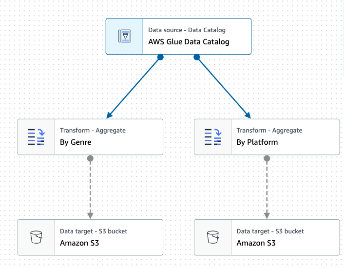
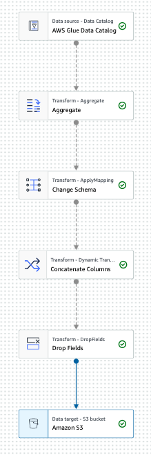
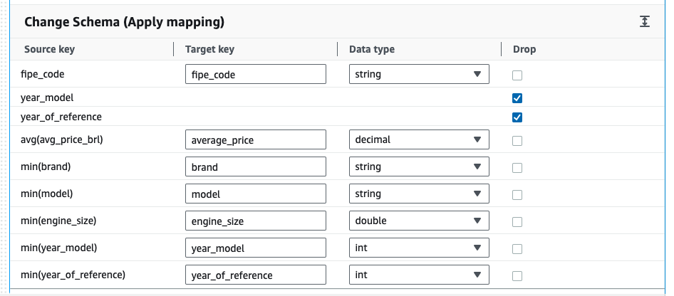

# 04 - Trabalho final

### Objetivo

1. Baixar os 2 datasets do trabalho final
2. Criar pastas separadas para cada dataset no S3 e fazer upload dos arquivos
3. Criar um crawler para cada dataset que resulte em tabelas no Athena
4. Criar 1 Glue job com o Glue Studio para cada dataset que faça a transformação dos dados e salve no S3 além de criar uma nova tabela no Athena.
5. Tire prints:
   1. Crawlers
   2. Tabelas do Athena criada pelos jobs
   3. Glue Jobs com configurações de cada passo
6. Copie o script spark criado por cada job e cole em arquivos separados.
7. Monte um zip com o material e envie no portal da FIAP.

### Glue Job por Dataset

### DataSet 1 - [Video Game Sales](https://www.kaggle.com/datasets/gregorut/videogamesales)

1. Data source: AWS Glue catalog criado pelo crawler para o dataset 1
2. Construir 2 agregações com soma de todos os valores de vendas global, america, japão e europa somados separadamente:
   1. Total de vendas por plataforma
   2. Total de vendas por gênero
3. Salvar os resultados em 2 arquivos separados no S3 no formato parquet e sem compressão. Crie uma tabela no catálogo de dados e nas execuções subsequentes, atualize o esquema e adicione novas partições.

### DataSet 2 - [Car Price Brazil](https://www.kaggle.com/datasets/vagnerbessa/average-car-prices-bazil)

1. Data source: AWS Glue catalog criado pelo crawler para o dataset 2
2. Agregem os valores agrupando por fipe_code, year_model, year_of_reference. A agregação deve ser a média(avg) de avg_price_brl e minino(min) de brand, model, engine_size, year_model, year_of_reference.
3. Mude o esquema para que fique como na imagem:
   
   

4. Concatene os valores das colunas brand e model em uma nova coluna chamada brand_model com o seguinte formato: brand_model = brand + " - " + model. EX: " 
Fiat - Fiorino Furgão 1.5 mpi / i.e. 8v"

5. Utilize o drop fields para remover as colunas brand e model.
6. Salve os resultados em 1 arquivo no S3 no formato parquet e sem compressão. Crie uma tabela no catálogo de dados e nas execuções subsequentes, atualize o esquema e adicione novas partições.

## Dicas:

1. Utilize o data preview sempre que possivel
2. Não esqueça de atualizar os output schema de acordo com o data preview
3. Quando for criar as pastas de saida dos jobs no S3, colocar em pastas exclusivas para cada job e o athena não confunda com os arquivos originais do dataset.